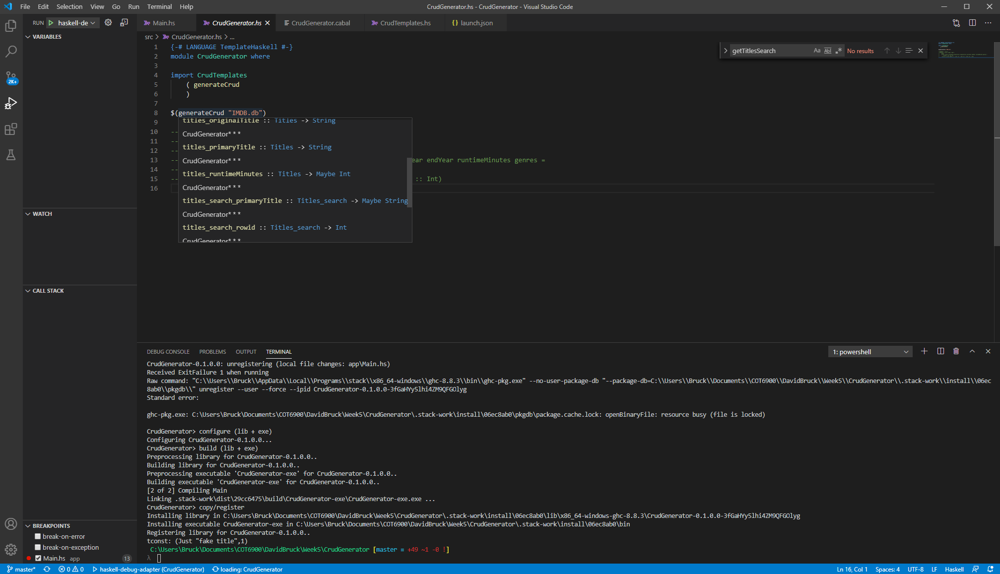

### David Bruck COT6900 - Week 5

### Database helpers for SQLite

I added 3 public database helper functions:

* `withDatabase`: Opens a connection to a SQLite database and creates the database if it does not exist. While the connection is open, it calls a provided callback function with the open database connection. It always closes the connection once the callback function returns, and aggregates exceptions.
* `databaseQuery`: Takes a SQL string, open database connection (from `withDatabase`), parameters, and a transformer (to allow us to turn dynamically-typed arrays of column results into strongly-typed Haskell datatypes).
* `getSchema`: Queries tables and virtual tables (e.g. FullText search tables) and includes their names, types, and columns (which themselves have names, types, nullability, primary key). This is used by the Template Haskell to automatically build strongly-typed Haskell datatypes corresponding to the types and nullability for each field's original column.

DatabaseHelpers/src/DatabaseHelpers.hs :

```haskell
module DatabaseHelpers
    ( getSchema
    , withDatabase
    , databaseQuery
    , SchemaColumn(..)
    , SchemaTable(..)
    ) where

import Control.Exception
    ( bracket
    , toException
    , throwIO
    , SomeException
    , Exception
    )
import Data.Text
    ( pack
    , unpack
    , replace
    , Text
    )
import Data.List
    ( isSuffixOf
    )
import Data.Int
    ( Int64
    )
import Text.Printf
    ( printf
    )
import Database.SQLite3
    ( open
    , prepare
    , finalize
    , step
    , columns
    , bind
    , SQLData(..)
    , StepResult(..)
    )
import qualified Database.SQLite3.Direct
    ( close
    , Database
    )
import qualified Database.SQLite3.Bindings.Types
    ( Error
    )
import Control.Monad.Except
    ( runExceptT
    , lift
    , throwError
    , ExceptT
    )
import Control.Error.Util
    ( syncIO
    )
import qualified Data.HashSet
    ( fromList
    , member
    )

newtype SQLErrorException = SQLErrorException
    { enumError :: Database.SQLite3.Bindings.Types.Error
    } deriving (Show)

newtype SQLStringException = SQLStringException
    { stringError :: String
    } deriving (Show)

newtype AggregateException = AggregateException
    { errors :: [SomeException]
    } deriving (Show)

instance Exception SQLErrorException
instance Exception SQLStringException
instance Exception AggregateException

data TableType = Table | FullText | FullTextStorage
    deriving (Eq, Show)

data SchemaColumn = SchemaColumn
    { cid           :: Int64
    , name          :: Text
    , type'         :: Maybe Text
    , notnull       :: Int64
    , dflt_value    :: Maybe Text
    , pk            :: Int64
    }
    deriving (Show)

data SchemaTable = SchemaTable
    { tableName     :: Text
    , tableType     :: TableType
    , tableColumns  :: [SchemaColumn]
    }
    deriving (Show)

getSchema :: Database.SQLite3.Direct.Database ->
             ExceptT SomeException IO [SchemaTable]
getSchema conn =
    do tableNames <- parameterlessQuery
                         ( "SELECT name\n" ++
                           "FROM sqlite_master\n" ++
                           "WHERE type = 'table'"
                         )
                         nameTransformer
       let tableNamesAndTypes = appendTableType tableNames
       let nonFullTextStorageTables =
               filter
                   (\(tableName, tableType) ->
                       tableType /= FullTextStorage)
                   tableNamesAndTypes
       mapM getTableSchema nonFullTextStorageTables
    where
    parameterlessQuery sql = databaseQuery sql conn []

    getTableSchema :: (Text, TableType) -> ExceptT SomeException IO SchemaTable
    getTableSchema (tableName, tableType) =
        do columns <- parameterlessQuery
                          (pragmaTable
                              tableName)
                          schemaTransformer
           return $ SchemaTable
               tableName
               tableType
               (if tableType == FullText
                then columns ++
                         [fullTextRowID
                             $ length columns]
                else columns)

    fullTextRowID colsLength =
        SchemaColumn
        { cid           = fromIntegral colsLength
        , name          = pack "rowid"
        , type'         = Just $ pack "INTEGER"
        , notnull       = 1
        , dflt_value    = Nothing
        , pk            = 1
        }
    appendTableType tableNames =
        map
            (\tableName -> (tableName, getTableType $ unpack tableName))
            tableNames
        where
        getTableType tableName
            | Just endingLength <- matchFullTextStorageEnding
                                       tableName
                                       fullTextStorageEndings
            , True              <-
                isFullTextTable
                    $ take (length tableName - endingLength) tableName =
                        FullTextStorage
            | True              <- isFullTextTable tableName    = FullText
            | otherwise                                         = Table
        isFullTextTable tableName =
            all
                (\ending -> Data.HashSet.member
                                (pack $ tableName ++ ending)
                                tableNamesSet)
                fullTextStorageEndings

        matchFullTextStorageEnding :: String -> [String] -> Maybe Int
        matchFullTextStorageEnding _ []             = Nothing
        matchFullTextStorageEnding tableName (x:xs) =
            if x `isSuffixOf` tableName
            then Just $ length x
            else matchFullTextStorageEnding tableName xs
                                                               
        fullTextStorageEndings  = [ "_data"
                                  , "_idx"
                                  , "_content"
                                  , "_docsize"
                                  , "_config"
                                  ]
        tableNamesSet           = Data.HashSet.fromList tableNames

    pragmaTable name = printf
                           "pragma table_info(\"%s\")"
                           escapedName
        where
        escapedName = unpack $ replace oneQuote twoQuotes name
        oneQuote = pack "\""
        twoQuotes = pack "\"\""

    nameTransformer [SQLText name]  = return name
    nameTransformer _                   =
        throwIO $ SQLStringException "expecting just SQLText column"

    schemaTransformer
        [ SQLInteger cid
        , SQLText name
        , type'
        , SQLInteger notnull
        , dflt_value
        , SQLInteger pk
        ]
        | True <- validMaybeText type'
        , True <- validMaybeText dflt_value =
            return $ SchemaColumn
                         cid
                         name
                         (maybeText type')
                         notnull
                         (maybeText dflt_value)
                         pk
        where
        validMaybeText maybeText
            | SQLNull   <- maybeText    = True
            | SQLText _ <- maybeText    = True
            | otherwise                 = False
        maybeText SQLNull               = Nothing
        maybeText (SQLText value)       = Just value
    schemaTransformer _ =
        throwIO $ SQLStringException
            "expecting schema columns (Int, Text, Text, Int, Text NULL, Int)"

withDatabase :: (Database.SQLite3.Direct.Database ->
                    ExceptT SomeException IO a) ->
                String ->
                ExceptT SomeException IO a
withDatabase operations name =
    do conn     <- syncIO $ open $ pack name
       result   <- syncIO $ runExceptT $ operations conn
       case result of
           Left err         -> do closed <- lift
                                                $ runExceptT
                                                $ closeDatabase conn
                                  case closed of
                                      {-
                                          An error occurred on database
                                          operations and also closing the
                                          connection; aggregate both
                                      -}
                                      Left err' -> throwError (toException
                                                       $ AggregateException
                                                           [err, err'])
                                      Right _   -> throwError err
           Right result'    -> do closeDatabase conn
                                  return result'

    where
    closeDatabase :: Database.SQLite3.Direct.Database ->
                     ExceptT SomeException IO ()
    closeDatabase conn =
        do closed <- syncIO $ Database.SQLite3.Direct.close conn
           case closed of
               Left err -> throwError $ toException $ SQLErrorException err
               Right _  -> pure ()

databaseQuery :: String ->
                 Database.SQLite3.Direct.Database ->
                 [SQLData] ->
                 ([SQLData] -> IO a) ->
                 ExceptT SomeException IO [a]
databaseQuery sql conn params transform =
    syncIO $ bracket
                 (do stmt <- prepare conn $ pack sql
                     if null params
                     then pure ()
                     else bind stmt params
                     return stmt)
                 finalize
                 readRows

    where
    readRows stmt =
        do result <- step stmt
           case result of
               Row  -> do x     <- columns stmt >>= transform
                          xs    <- readRows stmt
                          return (x : xs)
               Done -> pure []
```


### Initialize Database

Creates first table in the database for IMDB "Titles" (e.g. movie listings).

To use, change directory to Week5 folder in a terminal, then run command:

* `cabal v2-run InitializeDatabase`

This will create an IMDB.db file in the current directory. It is used when you run the other applications.

There is currently no code written to populate data into this database, so you can create test records by loading up a SQLite commandline executable like sqlite3.exe and running the following SQL:

```sql
INSERT INTO titles (tconst, titleType, primaryTitle, originalTitle, startYear, endYear, runtimeMinutes, genres)
VALUES (1, 'fake', 'fake title', 'fake title', 2020, NULL, NULL, NULL);

INSERT INTO titles (tconst, titleType, primaryTitle, originalTitle, startYear, endYear, runtimeMinutes, genres)
VALUES (2, 'fake', 'fake titles', 'fake titles', 2020, NULL, NULL, NULL);

INSERT INTO titles_search (rowid, primaryTitle) SELECT tconst, primaryTitle FROM titles;
```


InitializeDatabase/app/Main.hs :

```haskell
module Main where

import DatabaseHelpers
    ( withDatabase
    , databaseQuery
    )

import Control.Monad.Except
    ( runExceptT
    , throwError
    , ExceptT
    )
import Control.Exception
    ( toException
    , SomeException
    , Exception
    )

newtype InitializationException = InitializationException
    { error :: String
    } deriving (Show)

instance Exception InitializationException

main :: IO ()
main = do result <- runExceptT $ initializeDatabase `withDatabase` "IMDB.db"
          case result of
              Left err -> print $ "Error: " ++ show err
              Right _  -> putStrLn "Success"
    where
    initializeDatabase conn =
        do existing <- parameterlessQuery
                           ( "SELECT 1\n" ++
                             "FROM sqlite_master"
                           )
           if null existing
           then do parameterlessQuery
                       ( "CREATE TABLE titles (\n" ++
                         "tconst INTEGER PRIMARY KEY,\n" ++
                         "titleType TEXT NOT NULL,\n" ++
                         "primaryTitle TEXT NOT NULL,\n" ++
                         "originalTitle TEXT NOT NULL,\n" ++
                         "startYear INTEGER NOT NULL,\n" ++
                         "endYear INTEGER NULL,\n" ++
                         "runtimeMinutes INTEGER NULL,\n" ++
                         "genres TEXT\n" ++
                         ") WITHOUT ROWID"
                       )
                   parameterlessQuery
                       ( "CREATE VIRTUAL TABLE titles_search\n" ++
                         "USING FTS5(primaryTitle)"
                       )
           else throwError
                    $ toException
                    $ InitializationException "database already initialized"

        where
        parameterlessQuery sql = databaseQuery sql conn [] return
```


### Template Haskell CRUD Generator

Work-in-progress. Right now, the Template Haskell `$(generateCrud "IMDB.db")` will generate datatypes for all the tables and virtual tables in the SQLite database file specified by its string parameter "IMDB.db".




CrudGenerator/src/CrudTemplates.hs :

```haskell
module CrudTemplates
    ( generateCrud
    ) where

import DatabaseHelpers
    ( withDatabase
    , getSchema
    , SchemaColumn(..)
    , SchemaTable(..)
    )
import Data.Text
    ( unpack
    )
import Data.Char
    ( toUpper
    , toLower
    )
import Data.Maybe
    ( isNothing
    )
import Control.Applicative
    ( (<$>)
    )

import Control.Monad.Except
    ( runExceptT
    )
import Control.Exception
    ( toException
    , throw
    , SomeException
    , Exception
    )

import Control.Monad
import Language.Haskell.TH

newtype UnhandledSchemaException = UnhandledSchemaException
    { error :: String
    } deriving (Show)

instance Exception UnhandledSchemaException

generateCrud :: String -> Q [Dec]
generateCrud filePath = runIO getDatabaseSchema >>= crudFromSchema

    where
    getDatabaseSchema =
        do result <- runExceptT $ getSchema `withDatabase` filePath
           case result of
               Left err     -> throw err
               Right schema -> return schema

    crudFromSchema []       = throw $ toException
                                  $ UnhandledSchemaException
                                        "uninitialized database"
    crudFromSchema tables   =
        do let dataTypes = generateDataTypes tables
           -- queries      <- generateQueries tables
           return dataTypes

    generateDataTypes []        = []
    generateDataTypes (x:xs)    =
        DataD
            []
            capitalizedName
            []
            Nothing
            [fields]
            []
        : generateDataTypes xs

        where
        name = unpack $ tableName x
        capitalizedName = mkName $ capitalize name
        columns = crudFields name $ tableColumns x
        fields = RecC capitalizedName columns

    -- generateQueries []      = []
    -- generateQueries (x:xs)  =
    --     do 

    capitalize []               = []
    capitalize (x:xs)           = toUpper x : xs

    lowercase []                = []
    lowercase (x:xs)            = toLower x : xs

    crudFields tableName []     = []
    crudFields tableName (x:xs) =
        ( mkName (lowercase tableName ++ "_" ++ unpack (name x))
        , Bang NoSourceUnpackedness NoSourceStrictness
        , columnType (unpack <$> type' x) $ notnull x
        )
        : crudFields tableName xs

    columnType sqlType
        | isNothing sqlType         = makeType "String"
        | sqlType == Just "TEXT"    = makeType "String"
        | sqlType == Just ""        = makeType "String"
        | sqlType == Just "INTEGER" = makeType "Int"
        | otherwise                 = throw $ toException
                                          $ UnhandledSchemaException
                                          $ "unhandled SQL column type "
                                                ++ show sqlType
    makeType haskellType notnull =
        if notnull == 1
        then ConT $ mkName haskellType
        else AppT (makeType "Maybe" 1) (makeType haskellType 1)
```


CrudGenerator/src/CrudGenerator.hs :

```haskell
{-# LANGUAGE TemplateHaskell #-}
module CrudGenerator where

import CrudTemplates
    ( generateCrud
    )

$(generateCrud "IMDB.db")
```


The code in its current state will query up to 2 records, but the hardcoded FullText Search `MATCH 'title fake*'` only matches exactly 1 record, but if you put another asterisk (`*`) after `title` like `'title* fake*`' it will match the other record too.

Work in progress, which will be removed later; CrudGenerator/app/Main.hs :

```haskell
module Main where

import CrudGenerator
import DatabaseHelpers
import Database.SQLite3
import Data.Either
import Control.Monad.Except
import Control.Exception
import Data.Text
--import CrudTemplates

main :: IO ()
main = do --let a = generateCrud "IMDB.db"
          limitOne <- runExceptT $ (`getTitlesSearch` 2) `withDatabase` "IMDB.db"
          case limitOne of
              Left err -> print err
              Right ttls -> forM_ ttls printTitlesSearch
          --print $ show (tconst, titleType, primaryTitle, originalTitle, startYear, endYear, runtimeMinutes, genres)
    where
    -- Titles tconst titleType primaryTitle originalTitle startYear endYear runtimeMinutes genres =
    --     Titles 1 "titleType2" "primaryTitle3" "originalTitle4" 2005 (Just 2006) (Just 2007) (Just "genres8")
    
    --printTitles (Titles tconst titleType primaryTitle originalTitle startYear endYear runtimeMinutes genres) = putStrLn $ "tconst: " ++ show (tconst, titleType, primaryTitle, originalTitle, startYear, endYear, runtimeMinutes, genres)
    printTitlesSearch (Titles_search primaryTitle rowid) = putStrLn $ "tconst: " ++ show (primaryTitle, rowid)

    --getTitles conn limit = databaseQuery "SELECT tconst, titleType, primaryTitle, originalTitle, startYear, endYear, runtimeMinutes, genres FROM titles ORDER BY tconst LIMIT ?" conn [SQLInteger (fromIntegral limit)] (\[SQLInteger tconst, SQLText titleType, SQLText primaryTitle, SQLText originalTitle, SQLInteger startYear, SQLNull, SQLNull, SQLNull] -> pure (Titles (fromIntegral tconst) (unpack titleType) (unpack primaryTitle) (unpack originalTitle) (fromIntegral startYear) Nothing Nothing Nothing))
    getTitlesSearch conn limit = databaseQuery "SELECT primaryTitle, rowid FROM titles_search WHERE primaryTitle MATCH 'title fake*' ORDER BY rank LIMIT ?" conn [SQLInteger (fromIntegral limit)] (\[primaryTitle, SQLInteger rowid] -> pure (Titles_search (case primaryTitle of SQLNull -> Nothing; SQLText primaryTitle -> Just $ unpack primaryTitle) (fromIntegral rowid)))
    --getTitles conn limit = databaseQuery "SELECT tconst, titleType, primaryTitle, originalTitle, startYear, endYear, runtimeMinutes, genres FROM titles ORDER BY tconst LIMIT ?" conn [SQLInteger (fromIntegral limit)] (\[SQLInteger tconst, SQLText titleType, SQLText primaryTitle, SQLText originalTitle, SQLInteger startYear, SQLNull, SQLNull, SQLNull] -> pure (Titles (fromIntegral tconst) (unpack titleType) (unpack primaryTitle) (unpack originalTitle) (fromIntegral startYear) Nothing Nothing Nothing))
```


The next step would be to be able to dynamically create at least 2 different types of queries, one for FullText search tables, and one for other tables. It would call `databaseQuery` and create a transformer to return results of the types we're already generating from TemplateHaskell (e.g. `Titles` and `Titles_search` for the current 2 tables). Then, we could generate TemplateHaskell for database inserts as well.

We would then use the database insert logic along with the IMDB titles data (freely available for download from [https://datasets.imdbws.com/](https://datasets.imdbws.com/)) which we would parse directly into the database.

Then, we still need to create an HTTP server to host searchable movie titles such as via instructions: [https://hackage.haskell.org/package/http-server](https://hackage.haskell.org/package/http-server)